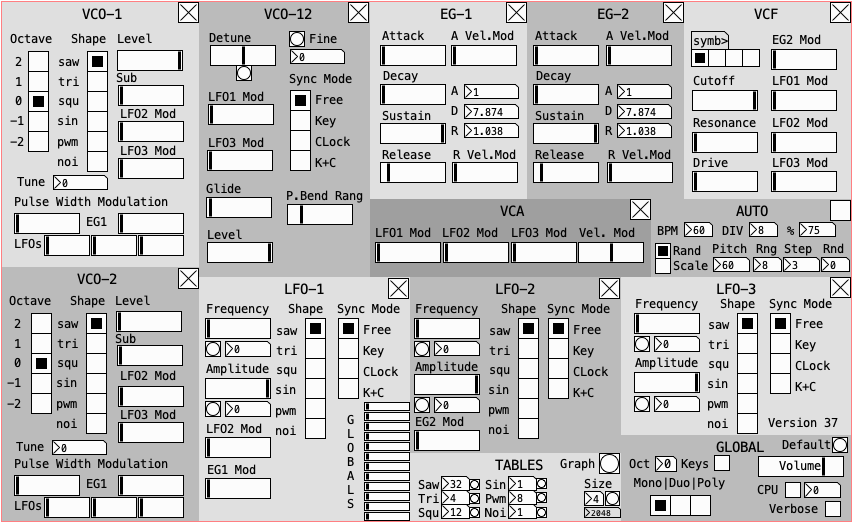

# Apollo1

Apollo1 is an open source Pure Data patch that can run inside a DAW using the Camomile audio plugin by Pierre Guillot. It is a copy of the Apollo 1 Analog Synthesizer by Guido Salaya (GS Music). It is intended for educational purposes.

Head to the Releases to get the plugin for your OS, or clone/download the source code to use it as a Pd patch.

Have fun!

fdch

